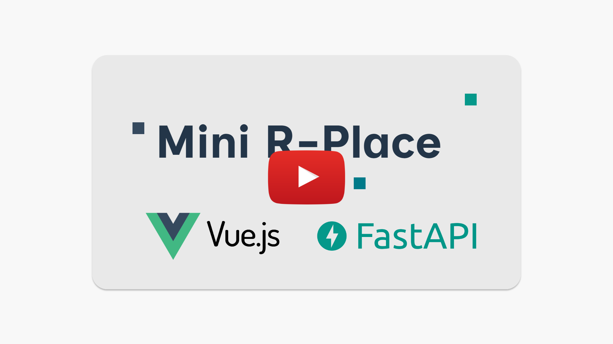
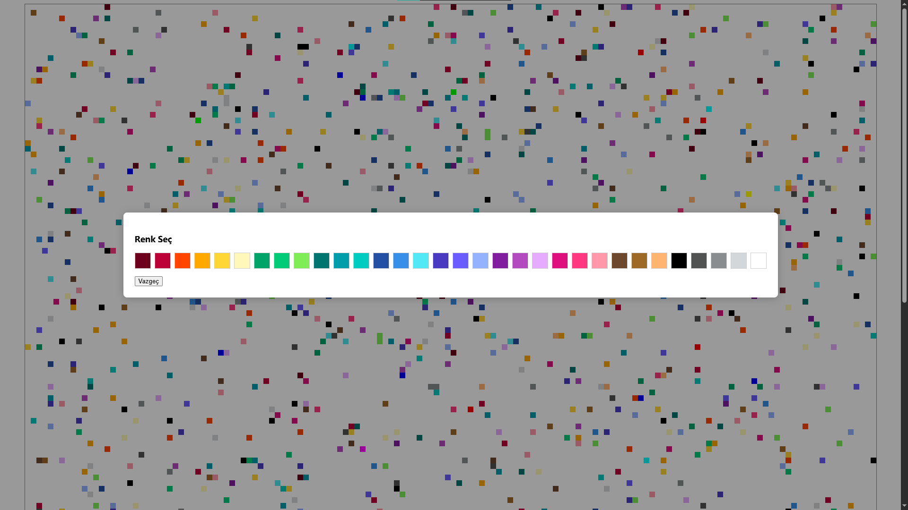

# Mini rPlace

Mini rPlace is a small-scale r/place clone where you and your friends can paint pixels together in real time. It is built with FastAPI, Vue.js, and Redis, and can be easily set up and run with Docker.


[](https://youtu.be/BSK8Dn7GpaQ)

> // preview 


## Features
- Real-time, multi-user mini canvas (e.g. 50x50)
- Instant updates via WebSocket
- Modern and user-friendly Vue.js interface
- Color selection with modal and palette
- Easy setup with Docker Compose

## Use Case
You can organize a mini rPlace event with your friends, paint pixels together, and create fun maps. Everyone can join from their own device and see changes instantly.

## Installation

### Requirements
- Docker
- Docker Compose

### Steps

1. **Clone the project:**
   ```bash
   git clone <project-link>
   cd MiniPlace
   ```

2. **Start all services:**
   ```bash
   docker-compose up --build
   ```

3. **Access the app:**
   - Frontend (Vue interface): [http://localhost:8080](http://localhost:8080)
   - Backend (API): [http://localhost:8000/docs](http://localhost:8000/docs)

4. **Invite your friends:**
   Everyone can join the same address in their browser and collaborate on the canvas together.

## Developer Notes
- Canvas size and color palette can be easily customized.
- Real-time updates are provided via WebSocket, no extra refresh needed.
- The codebase is written with FastAPI (Python) and Vue 3 (JavaScript).

## Contribution & License
Feel free to open a PR or issue if you want to contribute. For license information, please contact the project owner.

---

**Start your own mini rPlace event and have fun together!** 